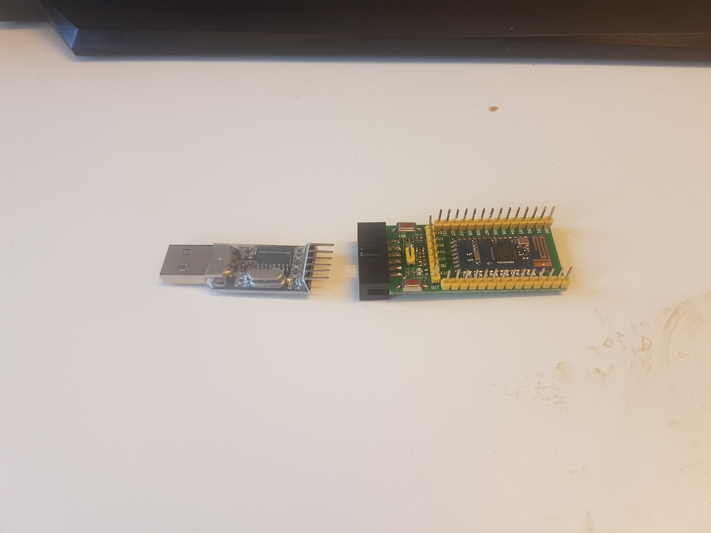
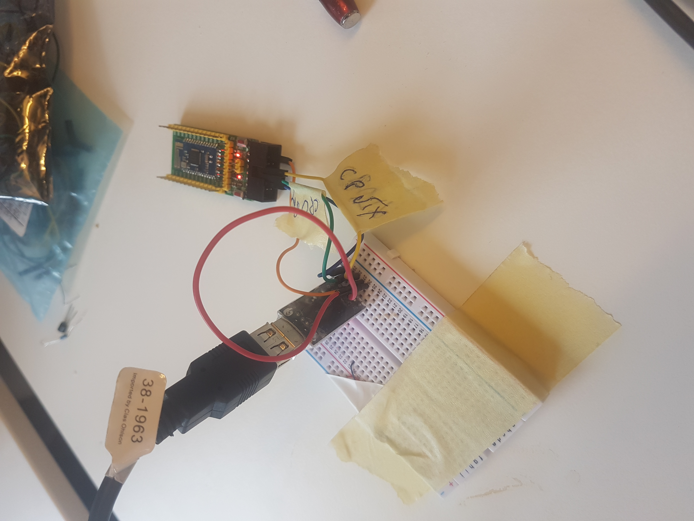

# Getting started with Contiki OS

Contiki OS is an open source Real Time OS which runs on a multitude of platforms.  It is especially useful for creating connected devices and is a lightweight monolithic RTOS with the entire TCP/IP stack implemented.

## Toolchain

To get started with Contiki OS it is essential to have the correct toolchain for compiling and flashing.  This also depends on the hardware (aka chipset) we compile to.  List of supported hardware can be found [here](http://www.contiki-os.org/hardware.html).

### GCC ARM Compiler

[Download](https://launchpad.net/gcc-arm-embedded/+milestone/5-2016-q3-update) the compiler and add the files in bin to the path. eg add them to ~/bin.  The linked gcc arm compiler is of a previous version (5) due to me in this case working with others who were using this compiler as well.  

If you are on a Debian based linux system you can install the latest gcc-arm compiler through apt.  You may also need some other tools depending on the platform. (in this case nrf58323) : 

```
# apt-get install gcc-arm-none-eabi make bluez libcap-ng0 radvd picocom git
```

### Contiki OS repository

Clone the Contiki OS repo from git and add it to your path

```
$ cd $HOME
$ git clone https://github.com/contiki-os/contiki.git
``` 

## Platform specific 
### nRF5
You need to download and install the nRF5 IOT SDK in order t compile to nRF58323, and point the NRF32_SDK_ROOT environment variable to its path
```
$ wget ttps://developer.nordicsemi.com/nRF5_IoT_SDK/nRF5_IoT_SDK_v0.9.x/nrf5_iot_sdk_3288530.zip
$ unzip nrf5_iot_sdk_3288530.zip -d $HOME/nrf5x-sdk 
$ export NRF52_SDK_ROOT=$HOME/nrf5x-sdk
```

You also need to download and install the Segger JLink Software.  This is for debugging purposes on the nrf hardware.  Go to [this](https://www.segger.com/downloads/jlink/) site and download the "Software and documentation pack" appropriate for your machine

## Hello World
### Compiling

Contiki comes with a couple of examples which can be found in the ``` contiki/examples/hello-world ``` folder.

```
  #include "contiki.h"
  #include "dev/leds.h"

  #include <stdio.h> /* For printf() */

  PROCESS(hello_world_process, "Hello world process");
  AUTOSTART_PROCESSES(&hello_world_process);

  PROCESS_THREAD(hello_world_process, ev, data)
  {
    PROCESS_BEGIN();
    printf("Hello, world\n"); 
    PROCESS_END();
  }
```

Go to the folder and execute the make command in the shell.  We will be assuming that we are using nrf here:

```
  $ make TARGET=nrf52dk
```

If this runs without errors, then we have verified that the toolchain is working as it should.

### Flashing
#### Connecting hardware
First you need your devboard of some sort and a way to interface with your computer.  In my case I am using a simple USB to UART thingy and a cheap devboard with an nrf58323 module on. In the case of the nrf chip we can flash it using its bootloader.  This means that when the device is reset, its bootloader looks for input on its UART interface for new firmware.  You can then supply this, and it gets flashed to the device.  Other ways to do this is through for example a JTAG, ICSP -> SPI and lots of others.  The point is to get instructions flashed to the device so that it has a program to run.


Connect up a USB-UART to the UART interface on your devkit or nrf5 so that the nrf chip gets powered and that the RX from the Computer UART is connected to device TX, and TX from computer gets connected to device RX.  It may save you a lot of pain to get some tape and mark the wires



And you should be now ready to flash the device.  Remember to hit the reset button upon flashing to let the bootloader run and look for new firmware.

#### Software flashing

If you have never run contiki on the device before, erase the device and flash it with a softdevice (which are wireless protocol stack libraries from nordicsemi)

```
  $ make TARGET=nrf52dk erase
  $ make TARGET=nrf52dk softdevice.flash
```

Finally you may now flash the application to the device

```
  $ make TARGET=nrf52dk hello-world.flash
```

And you can for example use picocom to debug the uart 

```
  $ sudo picocom -fh -b 38400 --imap lfcrlf /dev/ttyACM0
```

## Other Useful Tools

### srecord
``` 
$ apt-get install srecord 
```
Srecord is for stitches together binaries which may be useful

## Common issues / FAQ
- In the makefile, or when compiled, the board must be specified : TARGET=someboard
- make finds the correct device connected to the computer by itself when flashing
